# EDGE-QI System Block Diagram

## Complete System Architecture and Data Flow

```mermaid
graph TB
    %% Input Sources
    subgraph INPUT["📹 Input Sources"]
        CAM[Camera Feeds]
        SENSORS[Hardware Sensors]
        MOCK[Mock Data Sources]
        RTSP[RTSP Streams]
    end

    %% Data Acquisition Layer
    subgraph ACQ["🔄 Data Acquisition Layer"]
        VSP[Video Stream Processor]
        RPI[Raspberry Pi Sensors]
        JETSON[Jetson Nano Interface]
        SIM[Real-time Simulator]
    end

    %% Core Processing Layer
    subgraph CORE["⚙️ Core Processing Framework"]
        
        %% Scheduler Subsystem
        subgraph SCHED["📋 Intelligent Scheduler"]
            TASK_Q[Task Queue<br/>Priority-based]
            EXEC[Task Executor]
            WRAP[Task Wrapper]
        end
        
        %% Monitoring Subsystem
        subgraph MON["📊 System Monitors"]
            ENERGY[Energy Monitor<br/>Battery Level]
            NETWORK[Network Monitor<br/>Latency & QoS]
            PERF[Performance Monitor<br/>CPU/Memory]
        end
        
        %% Communication Layer
        subgraph COMM["📡 Communication Layer"]
            MQTT[MQTT Client<br/>Lightweight Protocol]
            EDGE_COMM[Edge Communication<br/>Inter-device]
            CONSENSUS[Consensus Protocol<br/>Distributed Decisions]
        end
    end

    %% ML Processing Layer
    subgraph ML["🧠 Machine Learning Layer"]
        
        %% Vision Tasks
        subgraph VISION["👁️ Computer Vision"]
            QUEUE_DET[Queue Detection<br/>YOLO/Custom]
            OBJ_DET[Object Detection<br/>Vehicle/Person]
            TRACK[Object Tracking<br/>Multi-target]
        end
        
        %% Analysis Tasks
        subgraph ANALYSIS["📈 Analytics Tasks"]
            TEMP_PRED[Temperature Prediction]
            ANOMALY[Anomaly Detection<br/>Full/Quantized]
            TRAFFIC[Traffic Flow Analysis]
        end
        
        %% Model Management
        subgraph MODELS["🔬 Model Management"]
            FULL[Full Precision Models]
            QUANT[Quantized Models]
            ADAPT[Adaptive Model Selection]
        end
    end

    %% Edge Collaboration Layer
    subgraph EDGE["🌐 Multi-Edge Collaboration"]
        
        subgraph COORD["🎯 Edge Coordinator"]
            ROLE[Role Management<br/>Leader/Worker]
            TOPO[Network Topology<br/>Management]
            LOAD_BAL[Load Balancing<br/>Distribution]
        end
        
        subgraph QUEUE_MGR["🚦 Distributed Queue Manager"]
            LOCAL_Q[Local Queue Data]
            GLOBAL_Q[Global Queue State]
            SYNC[Data Synchronization]
        end
        
        subgraph CONSENSUS_SYS["🤝 Consensus System"]
            VOTING[Voting Mechanisms]
            LEADER[Leader Election]
            DECISIONS[Distributed Decisions]
        end
    end

    %% Data Processing Pipeline
    subgraph PIPELINE["🔄 Data Processing Pipeline"]
        
        subgraph BANDWIDTH["📶 Bandwidth Optimization"]
            COMPRESS[Data Compression<br/>Smart Algorithms]
            STREAM[Adaptive Streaming<br/>Bitrate Control]
            PRIORITY[Priority Transfer<br/>QoS Management]
        end
        
        subgraph SUMMARIZER["📝 Intelligent Summarizer"]
            FILTER[Data Filtering]
            AGGREGATE[Data Aggregation]
            THRESHOLD[Change Detection]
            OPTIMIZE[Bandwidth Optimization]
        end
    end

    %% Output & Interface Layer
    subgraph OUTPUT["📊 Output & Interface Layer"]
        
        subgraph DASHBOARD["🖥️ Real-time Dashboard"]
            QUEUE_VIZ[Queue Heatmaps<br/>Spatial Visualization]
            TRAFFIC_VIZ[Traffic Analytics<br/>Flow Charts]
            NETWORK_VIZ[Network Topology<br/>Interactive Graph]
            ALERTS[Alert Management<br/>Notifications]
            METRICS[Performance Metrics<br/>System Health]
        end
        
        subgraph API["🔌 API Interfaces"]
            REST[REST API<br/>Data Access]
            WS[WebSocket<br/>Real-time Updates]
            MQTT_PUB[MQTT Publisher<br/>Results Distribution]
        end
        
        subgraph STORAGE["💾 Data Storage"]
            REAL_TIME[Real-time Cache]
            HISTORICAL[Historical Database]
            LOGS[System Logs]
        end
    end

    %% External Systems
    subgraph EXT["🌍 External Systems"]
        BROKER[MQTT Broker<br/>Message Hub]
        CLOUD[Cloud Services<br/>Backup Processing]
        EMERGENCY[Emergency Services<br/>Alert Integration]
        CITY[Smart City APIs<br/>Traffic Management]
    end

    %% Data Flow Connections
    %% Input to Acquisition
    CAM --> VSP
    SENSORS --> RPI
    SENSORS --> JETSON
    MOCK --> SIM
    RTSP --> VSP

    %% Acquisition to Core
    VSP --> SCHED
    RPI --> SCHED
    JETSON --> SCHED
    SIM --> SCHED

    %% Core Internal Flow
    TASK_Q --> EXEC
    EXEC --> WRAP
    WRAP --> TASK_Q
    
    %% Monitoring Integration
    ENERGY --> SCHED
    NETWORK --> SCHED
    PERF --> SCHED

    %% ML Processing Flow
    SCHED --> QUEUE_DET
    SCHED --> TEMP_PRED
    SCHED --> ANOMALY
    QUEUE_DET --> TRAFFIC
    OBJ_DET --> TRACK
    
    %% Model Adaptation
    MON --> ADAPT
    ADAPT --> FULL
    ADAPT --> QUANT

    %% Edge Collaboration Flow
    CORE --> COORD
    COORD --> QUEUE_MGR
    COORD --> CONSENSUS_SYS
    QUEUE_MGR --> SYNC
    CONSENSUS_SYS --> DECISIONS

    %% Data Pipeline Flow
    ML --> SUMMARIZER
    SUMMARIZER --> BANDWIDTH
    BANDWIDTH --> COMPRESS
    COMPRESS --> PRIORITY

    %% Communication Flow
    WRAP --> MQTT
    EDGE_COMM --> CONSENSUS
    CONSENSUS --> DECISIONS
    PRIORITY --> MQTT_PUB

    %% Dashboard Integration
    PIPELINE --> DASHBOARD
    EDGE --> NETWORK_VIZ
    ML --> QUEUE_VIZ
    ANALYSIS --> TRAFFIC_VIZ
    MON --> METRICS
    SUMMARIZER --> ALERTS

    %% External Connections
    MQTT --> BROKER
    MQTT_PUB --> BROKER
    BROKER --> CLOUD
    ALERTS --> EMERGENCY
    DASHBOARD --> CITY
    
    %% Storage Connections
    DASHBOARD --> REAL_TIME
    PIPELINE --> HISTORICAL
    CORE --> LOGS

    %% Styling
    classDef inputClass fill:#e1f5fe,stroke:#01579b,stroke-width:2px
    classDef coreClass fill:#f3e5f5,stroke:#4a148c,stroke-width:2px
    classDef mlClass fill:#e8f5e8,stroke:#1b5e20,stroke-width:2px
    classDef edgeClass fill:#fff3e0,stroke:#e65100,stroke-width:2px
    classDef outputClass fill:#fce4ec,stroke:#880e4f,stroke-width:2px
    classDef extClass fill:#f1f8e9,stroke:#33691e,stroke-width:2px

    class INPUT,ACQ inputClass
    class CORE,SCHED,MON,COMM coreClass
    class ML,VISION,ANALYSIS,MODELS mlClass
    class EDGE,COORD,QUEUE_MGR,CONSENSUS_SYS edgeClass
    class OUTPUT,DASHBOARD,API,STORAGE outputClass
    class EXT extClass
```

## System Components Description

### 1. **Input Sources Layer** 📹
- **Camera Feeds**: Live video streams from surveillance cameras
- **Hardware Sensors**: Temperature, motion, and environmental sensors
- **Mock Data Sources**: Simulated data for testing and development
- **RTSP Streams**: Real-time streaming protocol video feeds

### 2. **Data Acquisition Layer** 🔄
- **Video Stream Processor**: Handles multiple video stream formats and processing
- **Hardware Interfaces**: Raspberry Pi and Jetson Nano sensor integration
- **Real-time Simulator**: Generates realistic traffic and queue simulation data

### 3. **Core Processing Framework** ⚙️

#### Intelligent Scheduler 📋
- **Priority-based Task Queue**: Manages tasks based on importance and urgency
- **Task Executor**: Executes scheduled tasks with resource awareness
- **Task Wrapper**: Integrates summarization and result processing

#### System Monitors 📊
- **Energy Monitor**: Tracks battery levels and power consumption
- **Network Monitor**: Measures latency, bandwidth, and QoS metrics
- **Performance Monitor**: Monitors CPU, memory, and system health

#### Communication Layer 📡
- **MQTT Client**: Lightweight messaging for IoT communication
- **Edge Communication**: Inter-device communication protocols
- **Consensus Protocol**: Distributed decision-making algorithms

### 4. **Machine Learning Layer** 🧠

#### Computer Vision 👁️
- **Queue Detection**: Advanced queue analysis using YOLO and custom models
- **Object Detection**: Vehicle and pedestrian detection and classification
- **Object Tracking**: Multi-target tracking across video frames

#### Analytics Tasks 📈
- **Temperature Prediction**: ML-based environmental prediction
- **Anomaly Detection**: Identifies unusual patterns and behaviors
- **Traffic Flow Analysis**: Comprehensive traffic pattern analysis

#### Model Management 🔬
- **Adaptive Model Selection**: Dynamic switching between model versions
- **Full Precision Models**: High-accuracy models for optimal conditions
- **Quantized Models**: Lightweight models for resource-constrained scenarios

### 5. **Multi-Edge Collaboration Layer** 🌐

#### Edge Coordinator 🎯
- **Role Management**: Dynamic assignment of coordinator/worker roles
- **Network Topology Management**: Maintains network structure and connections
- **Load Balancing**: Distributes computational load across edge devices

#### Distributed Queue Manager 🚦
- **Local Queue Data**: Manages individual device queue information
- **Global Queue State**: Maintains comprehensive network queue status
- **Data Synchronization**: Ensures consistency across edge devices

#### Consensus System 🤝
- **Voting Mechanisms**: Democratic decision-making protocols
- **Leader Election**: Dynamic leadership assignment
- **Distributed Decisions**: Coordinated actions across the network

### 6. **Data Processing Pipeline** 🔄

#### Bandwidth Optimization 📶
- **Smart Data Compression**: Adaptive compression based on content and conditions
- **Adaptive Streaming**: Dynamic bitrate adjustment for optimal transmission
- **Priority Transfer Management**: QoS-aware data prioritization

#### Intelligent Summarizer 📝
- **Data Filtering**: Removes redundant and non-essential information
- **Data Aggregation**: Combines related data points for efficiency
- **Change Detection**: Identifies significant changes requiring transmission
- **Bandwidth Optimization**: Minimizes data transmission requirements

### 7. **Output & Interface Layer** 📊

#### Real-time Dashboard 🖥️
- **Queue Heatmaps**: Spatial visualization of queue densities
- **Traffic Analytics**: Comprehensive traffic flow analysis charts
- **Network Topology**: Interactive visualization of edge device network
- **Alert Management**: Intelligent notification and alert system
- **Performance Metrics**: Real-time system health and performance monitoring

#### API Interfaces 🔌
- **REST API**: Standard HTTP-based data access
- **WebSocket**: Real-time bidirectional communication
- **MQTT Publisher**: Results distribution via MQTT protocol

#### Data Storage 💾
- **Real-time Cache**: High-speed temporary data storage
- **Historical Database**: Long-term data persistence
- **System Logs**: Comprehensive system activity logging

### 8. **External Systems** 🌍
- **MQTT Broker**: Central message hub for system communication
- **Cloud Services**: Backup processing and data analytics
- **Emergency Services**: Integration with emergency response systems
- **Smart City APIs**: Integration with municipal traffic management

## Data Flow Description

### Primary Data Flow Path:
1. **Data Ingestion**: Camera feeds and sensors → Video Stream Processor/Hardware Interfaces
2. **Task Scheduling**: Data → Intelligent Scheduler (priority-based queue)
3. **Resource Checking**: Energy/Network monitors validate execution conditions
4. **ML Processing**: Tasks executed through Computer Vision and Analytics modules
5. **Result Processing**: ML results → Intelligent Summarizer (filtering & aggregation)
6. **Bandwidth Optimization**: Summarized data → Compression and Priority Transfer
7. **Communication**: Optimized data → MQTT Client → External MQTT Broker
8. **Visualization**: Processed data → Real-time Dashboard for monitoring
9. **Storage**: Results stored in real-time cache and historical database

### Edge Collaboration Flow:
1. **Local Processing**: Each edge device processes local queue data
2. **Inter-edge Communication**: Devices share queue states via Edge Communication
3. **Consensus Decision**: Distributed decisions made through Consensus Protocol
4. **Load Balancing**: Edge Coordinator redistributes tasks based on device capabilities
5. **Global Optimization**: Network-wide optimization based on collaborative intelligence

### Adaptive Behavior:
- **Energy-Aware**: Tasks skipped or deferred based on battery levels
- **Network-Aware**: Task execution adjusted based on network conditions
- **Quality-Aware**: Model selection (full/quantized) based on available resources
- **Priority-Aware**: Critical tasks (queue detection) prioritized over routine tasks

## System Benefits

### 🚀 **Performance Optimization**
- Priority-based task execution ensures critical operations complete first
- Adaptive model selection optimizes accuracy vs. resource consumption
- Distributed processing leverages multiple edge devices efficiently

### 🔋 **Energy Efficiency**
- Energy-aware scheduling extends battery life
- Intelligent summarization reduces data transmission energy costs
- Dynamic model switching conserves computational resources

### 🌐 **Network Optimization**
- QoS-aware task scheduling ensures reliable execution
- Bandwidth optimization minimizes network usage
- MQTT protocol provides lightweight, efficient communication

### 🧠 **Intelligent Operation**
- ML-driven anomaly detection identifies critical situations
- Consensus protocols enable coordinated decision-making
- Real-time adaptation to changing conditions and requirements

### 📊 **Comprehensive Monitoring**
- Real-time dashboard provides complete system visibility
- Multi-dimensional analytics support informed decision-making
- Alert system ensures rapid response to critical situations

This block diagram represents a complete, production-ready edge computing framework designed for intelligent queue management and traffic optimization in smart city applications.